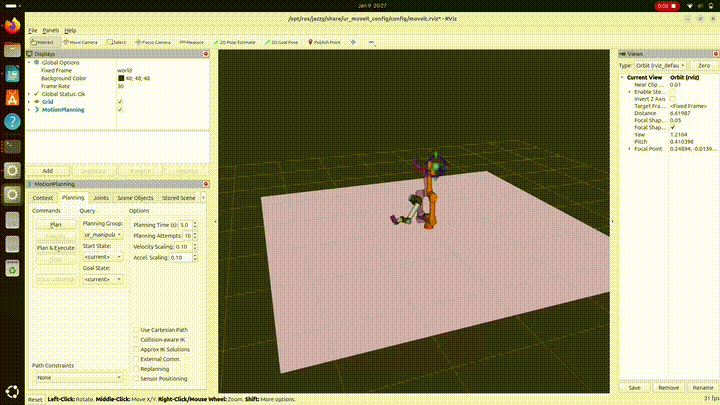

# UR5e MoveIt2 Pick & Place (ROS 2 Jazzy)

Simulation-first industrial pick & place pipeline using **ROS 2 Jazzy + MoveIt2 + UR5e**.
Includes **planning-scene grasp** (attach/detach) for a clean, reviewer-visible demo.

## Demo
- Pick: from object pose (`/object_pose`)
- Place: fixed drop zone
- Grasp: MoveIt **PlanningScene attach/detach** (stage-1 digital-twin grasp)



> Note: This is not Gazebo physics grasp yet. It’s the standard first stage used in industry/research for planning.

## Features
- MoveIt2 MoveGroup action control (`/move_action`)
- PlanningScene collision object add + attach + detach
- Fake perception publisher for `/object_pose`
- Safe step sequence: HOME → PREPICK → DESCEND → ATTACH → LIFT → PLACE → DETACH → RETREAT

## Requirements
- Ubuntu 24.04
- ROS 2 Jazzy
- `ur_simulation_gz` + MoveIt2 UR config

## How to Run (Fresh Terminals)

### Terminal 1: Launch UR5e + MoveIt2 + RViz + Gazebo
```bash
source /opt/ros/jazzy/setup.bash
ros2 launch ur_simulation_gz ur_sim_moveit.launch.py ur_type:=ur5e
````

### Terminal 2: Build + Source

```bash
source /opt/ros/jazzy/setup.bash
cd ~/ur5_ws
colcon build --symlink-install
source install/setup.bash
```

### Terminal 3: Publish object pose (fake perception)

```bash
source /opt/ros/jazzy/setup.bash
source ~/ur5_ws/install/setup.bash
ros2 run hri_manipulation fake_object_pose_publisher
```

### Terminal 4: Add collision object to planning scene

```bash
source /opt/ros/jazzy/setup.bash
source ~/ur5_ws/install/setup.bash
ros2 run hri_manipulation add_object
```

### Terminal 5: Run pick & place

```bash
source /opt/ros/jazzy/setup.bash
source ~/ur5_ws/install/setup.bash
ros2 run hri_manipulation pose_sender
```

## Repo Structure

* `hri_manipulation/moveit_pose_sender.py` — main pick & place
* `hri_manipulation/add_object.py` — add collision box
* `hri_manipulation/attach_object.py` — attach box to `tool0`
* `hri_manipulation/detach_object.py` — detach box
* `hri_manipulation/fake_object_pose_publisher.py` — publishes `/object_pose`

## Next Improvements

* Cartesian straight-line descend/lift (industrial motion)
* Robust retry + metrics logging
* YAML-config scene loader (digital twin)
* Real perception input for object pose

